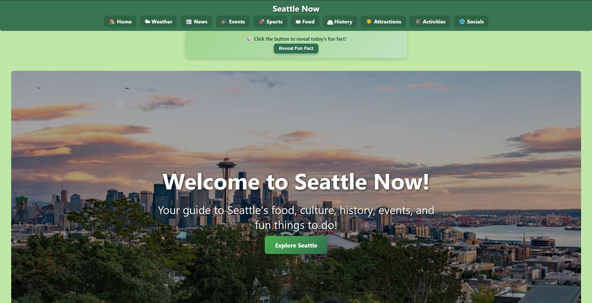
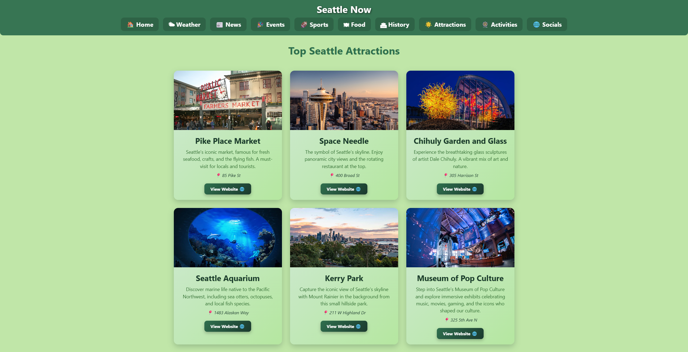
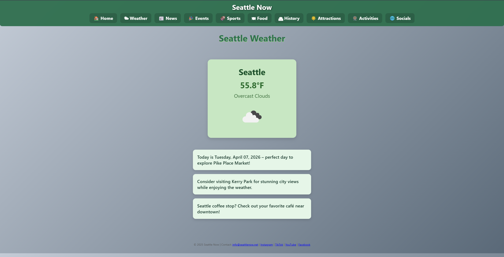

# SeattleNow

SeattleNow is a full-stack web application that aggregates essential Seattle information in one place, including weather, events, sports, news, and local attractions.

🔗 **Live Site:** https://seattlenow.net

---

## 🚀 Features

- **Weather**  
  Displays current conditions and forecast with dynamic backgrounds based on weather.

- **Events**  
  Shows upcoming events with filtering by category (concerts, festivals, etc.).

- **Sports**  
  Lists recent and upcoming Seattle team games with scores and schedules.

- **News**  
  Aggregates local Seattle headlines from reliable sources.

- **Attractions & Activities**  
  Curated list of popular places for locals and visitors.

---

## 🛠 Tech Stack

- **Frontend:** HTML, CSS, JavaScript, Jinja2  
- **Backend:** Python (Flask)  
- **Deployment:** Render

---

## 🔌 APIs Used

- OpenWeatherMap API (weather)
- Ticketmaster API (events & sports)
- RSS feeds (news)

---

## ⚙️ Project Architecture

- **Frontend:** HTML templates with Jinja2 and responsive CSS  
- **Backend:** Flask handles routing, API calls, and data formatting  
- **Deployment:** Hosted on Render, can run locally with Flask  

---

## 📸 Screenshots

---

## 📚 What I Learned

- Integrating multiple APIs into one platform  
- Building a full-stack application with Flask  
- Designing responsive and user-friendly interfaces  
- Structuring a multi-page web application  

---

## ⚙️ How to Run Locally

1. Clone the repository  
2. Navigate to the project folder  
3. Install dependencies:
   pip install -r requirements.txt  
4. Run the app:
   python app.py  
5. Open http://localhost:5000 in your browser  

---

## 📫 Contact

Email: taran.ubbi@gmail.com  
GitHub: https://github.com/TaranUbbi
Instagram: https://www.instagram.com/taran_ubbi
